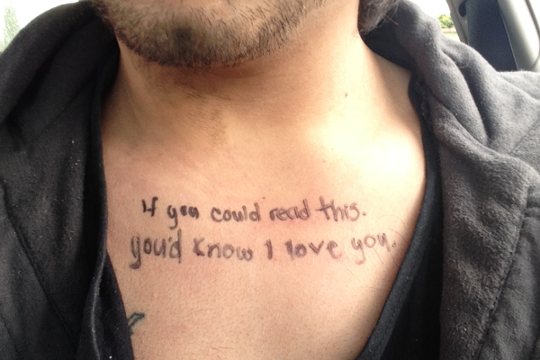

This is a list of resources, quotes, pieces of writting, short clips that often help bring me back from a rough patch: 

> “Courage doesn't always roar. Sometimes courage is the little voice at the end of the day that says I'll try again tomorrow.”
― Mary Anne Radmacher

> “Life happens wherever you are, whether you make it or not.”
― Uncle Iroh





> “Be strong enough to be gentle.”
― Larry Cullen

